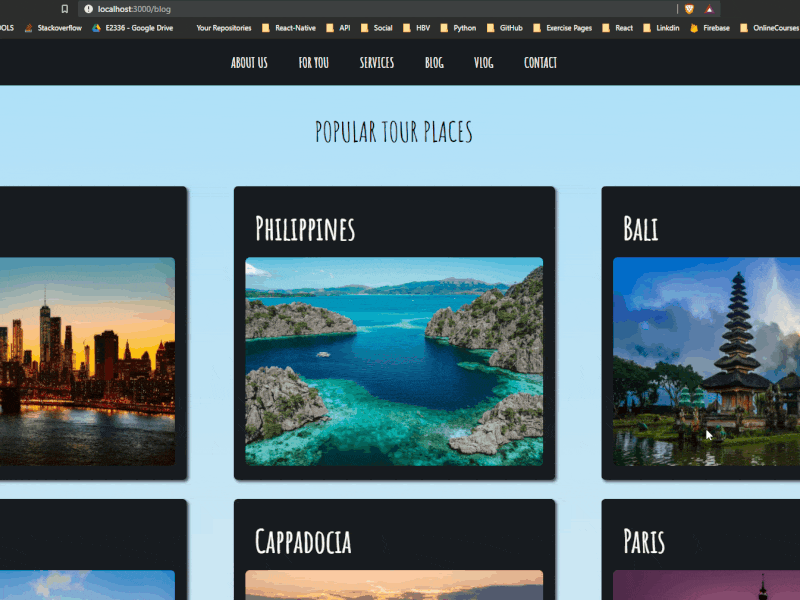

<p align="center">
  
  
  
  
</p>
<p align="center">
  
  
  
  
</p>

<h1 align="center">🗺️ Tour Experience Explorer</h1>

<p align="center">
This project demonstrates modular UI architecture by utilizing stateless functional components. It showcases effective data-mapping patterns and advanced Sass nesting/variables for scalable styling.
</p>

<div align="center">
  <h3>
    <a href="https://tour-experience-explorer-umitdev.vercel.app/">
      🖥️ Live Demo
    </a>
     | 
    <a href="https://github.com/umitarat-dev/Tour-Experience-Explorer.git">
      📂 Repository
    </a>
 
  </h3>
</div>

<p align="center">
  <a href="https://tour-experience-explorer-umitdev.vercel.app/">
    
  </a>
</p>

## 📚 Navigation

- [✨ Overview](#-overview)
- [📖 Description](#-description)
- [🚀 Features](#-features)
- [🗂️ Project Skeleton](#️-project-skeleton)
- [🛠️ Built With](#️-built-with)
- [⚡ How To Use](#-how-to-use)
- [📌 About This Project](#-about-this-project)
- [🙏 Acknowledgements](#-acknowledgements)
- [📬 Contact Information](#-contact-information)

## ✨ Overview

**Tour Places** is a simple React project designed to display tour destinations using a clean and component-based architecture.

The application focuses on **React fundamentals**, **props usage**, and **styling with Sass (SCSS)** while keeping the UI clean and readable.


## 📖 Description

This project demonstrates how to structure a small React application by separating UI into reusable components such as:

- Header
- Tour cards
- Footer

Tour data is managed through a helper file and rendered dynamically. Styling is handled using **Sass**, allowing better organization and scalability compared to plain CSS.

## 🚀 Features

- 🧩 Component-based React architecture.
- 🗂️ Reusable card components.
- 🎨 Modular styling with Sass (SCSS).
- 📄 Static data rendering from helper file.
- 📱 Clean and responsive layout.
- 🎯 Beginner-friendly React project structure.
- 📄 Stateless functional components for optimized rendering.
- 🎨 Interactive hover states and transitions powered by Sass.
- 🗂️ Modular SCSS structure using partials or variables.


## 🗂️ Project Skeleton
```
Tour Experience Explorer
|
|----readme.md   
SOLUTION
├── public
│     └── index.html
├── src
│    ├── components
│    │       ├── Main
│    │       │     ├── Main.scss
│    │       │     ├── Main.jsx
│    │       │     └── Card.jsx
│    │       ├── Navbar
│    │       │     ├── Navbar.scss
│    │       │     └── Navbar.jsx
│    │       ├── Header
│    │       │     ├── Header.scss
│    │       │     └── Header.jsx
│    │       └── Footer
│    │             ├── Footer.scss
│    │             └── Footer.jsx
│    ├── scss
│    │       ├── _mixins.scss
│    │       ├── _reset.scss
│    │       └── _variables.scss
│    │
│    ├── helpers
│    │       └── data.js
│    │
│    ├── App.js
│    ├── App.scss
│    ├── index.js
│    └── index.css
├── package.json
└── yarn.lock
```

## 🛠️ Built With

- **React**
- **JavaScript (ES6+)**
- **Sass / SCSS**
- **HTML5**
- **CSS3**
  


## ⚡ How To Use
<!-- This is an example, please update according to your application -->

To clone and run this application, you'll need [Git](https://github.com/Umit8098/React_Proj_Tour_Places.git)


```bash
# Clone this repository
$ git clone https://github.com/umitarat-dev/Tour-Experience-Explorer.git


$ yarn  
$ yarn start

$ or

$ npm install
$ npm start
```

## 📌 About This Project
This project was built to practice and improve:
  - React component structure
  - Props and data flow
  - Organizing a React project
  - Styling React applications with Sass
  - Writing clean and maintainable frontend code


## 🙏 Acknowledgements
- [Clarusway](https://clarusway.com/)

## 📬 Contact Information

I am always open to discussing new projects, creative ideas, or opportunities to be part of your visions.

* **LinkedIn:** [linkedin.com/in/umit-arat](https://www.linkedin.com/in/umit-arat/)
* **Email:** [umitarat8098@gmail.com](mailto:umitarat8098@gmail.com)
* **GitHub:** [github.com/umitarat-dev](https://github.com/umitarat-dev) (Current Workspace)